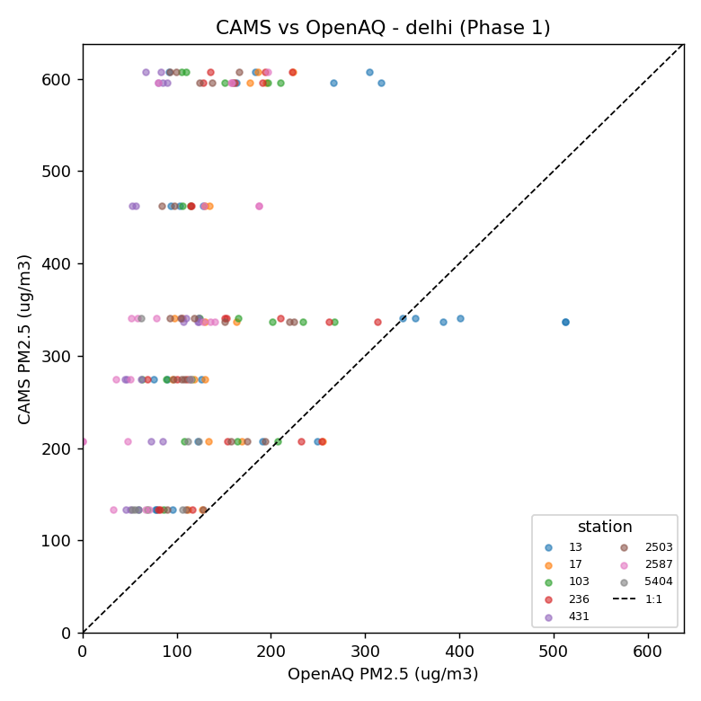
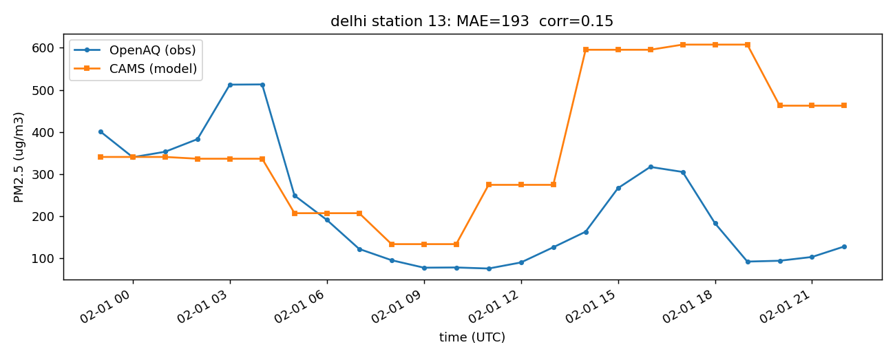
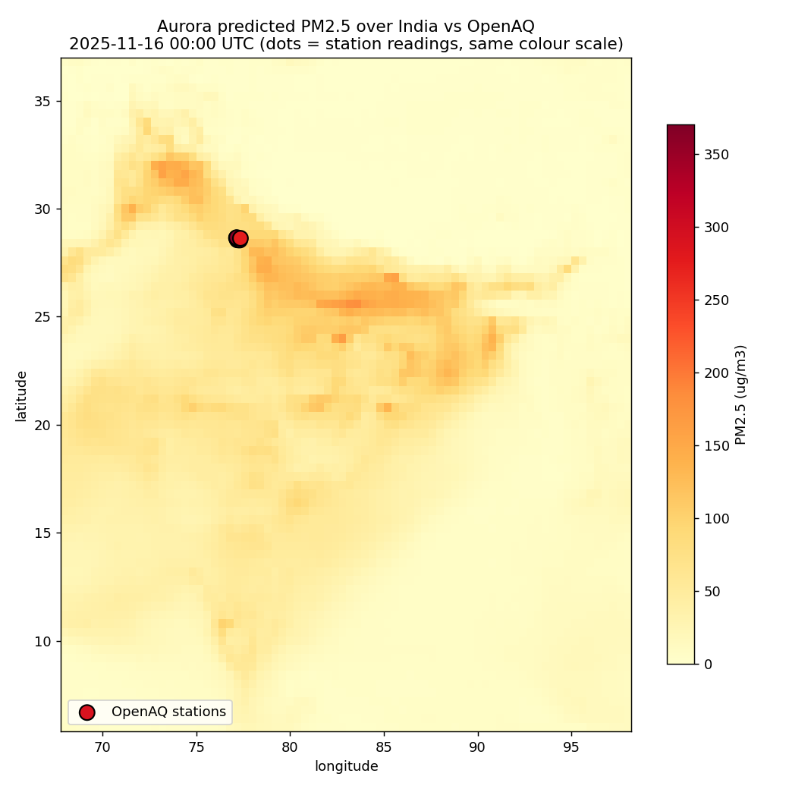

# Aurora for India — Can a global AI weather model forecast Indian air quality?

Benchmarking [Microsoft Aurora](https://github.com/microsoft/aurora), an
atmospheric foundation model, on **PM2.5 forecasting for Indian cities** —
without any region-specific fine-tuning.

## The research question

> Can a globally pretrained Earth-system model produce useful PM2.5 predictions
> for India — home to some of the world's most severe and most variable air
> pollution — and where exactly does it fail?

India's air-quality forecasting infrastructure is fragmented and often
inaccurate at the local level. If a global foundation model works out of the
box, it could underpin low-cost, high-coverage AQI forecasting across the
subcontinent. If it fails, the *failure patterns* tell us precisely what
regional adaptation is needed. Either answer is useful — that's what makes it
a benchmark and not a demo.

## Results so far (Phase 1 — global-model baseline)

Before running Aurora itself, we measure what a global atmospheric model
*already* "knows" about Indian PM2.5, using the CAMS global reanalysis (EAC4,
0.75°) as the model-side field, evaluated against real ground-station readings
from OpenAQ (CPCB/DPCC stations), for 2018-02-01:

| City      | Stations | Matched hours | CAMS MAE (µg/m³) |
|-----------|----------|---------------|------------------|
| Delhi     | 8        | 159           | **223**          |
| Mumbai    | 1        | 23            | 218 *(small sample)* |
| Chennai   | 2        | 44            | 65               |
| Bangalore | 3        | 61            | **41**           |

Two concrete failure modes, visible in the figures:

**1. Coarse resolution can't resolve intra-city variation.** Every station in
Delhi receives essentially the same CAMS value per timestep (horizontal bands),
while real stations spread widely — and skill vs. a naive persistence baseline
is negative at every station.



**2. The diurnal cycle is out of phase.** CAMS puts Delhi's pollution peak in
the evening; the stations peak pre-dawn. Correlation ≈ 0.15.



**Headline finding:** the global model's error scales with pollution severity —
huge in the most polluted cities (Delhi), modest in cleaner southern cities
(Bangalore). This quantifies exactly the gap a fine-tuned or higher-resolution
model must close, and motivates Phase 2.

## Results so far (Phase 2 — Aurora Air Pollution, run directly)

We then ran Aurora itself — specifically **`AuroraAirPollution`** (the 1.3B-param
`aurora-0.4-air-pollution` checkpoint), which predicts PM2.5 *directly* — on
global CAMS analysis data, and forecast +12 h from 2025-11-15 12:00 UTC (peak
Delhi winter-pollution season). Aurora reproduces India's Indo-Gangetic
pollution belt, but at Delhi its predicted PM2.5 sits far below the ground
stations:



The dark dots (OpenAQ stations, 187–370 µg/m³) sit on a pale model field
(~86 µg/m³) — Aurora predicts **~86 µg/m³** for the Delhi cell while stations
read **187–370 µg/m³** (mean absolute error ≈ **202 µg/m³**).

Crucially, this is *not* an Aurora bug: the CAMS analysis it was given already
reads only 85–98 µg/m³ at the Delhi cell, and Aurora faithfully evolves that
field (86 µg/m³ at +12 h). **The global input under-represents Delhi's extreme
local pollution by 2–4×, and Aurora inherits it** — the same failure Phase 1
found in the reanalysis, now confirmed for the operational model. This is the
concrete, quantified case for local adaptation (Phase 4).

> Notably, the full 1.3B-param model ran end-to-end on a **32 GB CPU** (~12 min
> per global forecast) — no GPU was required for single-timestep inference.

## How it works

```
OpenAQ v3 API ──► openaq_client.py ──► data/openaq/{city}_pm25.csv   (ground truth)
Copernicus CDS ─► era5_downloader.py ─► data/era5/*.nc               (meteorology)
Copernicus ADS ─► era5_downloader.py ─► data/cams/*.nc               (model PM2.5)
                        │
                        ▼
                  align.py  ── nearest-grid-cell matching (haversine),
                        │      hourly join, kg/m³ → µg/m³ conversion
                        ▼
          data/processed/{city}_aligned.csv
                        │
                        ▼
        run_phase1.py / plots.py ──► per-station MAE/RMSE/correlation,
                                     skill vs persistence, figures
```

Everything is a CLI module. Reproduce the Delhi result:

```bash
python -m src.data.openaq_client   --city delhi --date-from 2018-02-01 --date-to 2018-02-03
python -m src.data.era5_downloader --dataset cams --city delhi --date-from 2018-02-01 --date-to 2018-02-01
python -m src.data.align           --city delhi --cams data/cams/delhi_cams_2018-02-01_2018-02-01.nc
python -m src.eval.run_phase1      --city delhi
python -m src.eval.plots           --city delhi
```

## Setup

```bash
python -m venv .venv && .venv/Scripts/activate   # or source .venv/bin/activate
pip install -r requirements.txt
```

Credentials (never committed):
- `OPENAQ_API_KEY` in `.env` — register at [explore.openaq.org](https://explore.openaq.org)
- `~/.cdsapirc` with a Copernicus personal access token — works for both the
  Climate Data Store (ERA5) and Atmosphere Data Store (CAMS); accept each
  dataset's licence once on the website.

## Status and roadmap

- [x] **Phase 1 — data pipeline + global-model baseline.** OpenAQ / ERA5 / CAMS
      clients, spatial alignment, metrics, plots; 4-city CAMS-vs-OpenAQ
      benchmark (above).
- [x] **Phase 2 — Aurora inference.** `AuroraAirPollution`
      (`aurora-0.4-air-pollution.ckpt`) run end-to-end on global CAMS analysis
      data; predicted PM2.5 sampled at OpenAQ stations (`src/model/aurora_runner.py`,
      `src/eval/run_phase2.py`). First result above (Delhi, 2025-11-15).
      GPU setup for scaling: `scripts/setup_a100.md`.
- [ ] **Phase 3 — evaluation at scale.** All 5 cities × 4 seasons
      (winter / pre-monsoon / monsoon / post-monsoon); failure-mode analysis
      by city and season.
- [ ] **Phase 4 — adaptation.** Bias correction / calibration on Aurora output;
      fine-tuning if resources allow.

## Honest limitations (so far)

- Phase 1 covers **one day** (2018-02-01) — chosen for OpenAQ sensor overlap;
  seasonal scale-out is Phase 3.
- Comparing a 0.75° grid cell to a point station carries inherent
  representativeness error; that's part of what's being measured, not a bug,
  but it means "CAMS MAE" conflates model error with resolution mismatch.
- Hourly persistence is a deliberately harsh baseline; at 24 h lead times the
  comparison will be fairer to forecast models.

## Data sources & credits

- Ground truth: [OpenAQ](https://openaq.org) (CPCB / DPCC / IMD station data).
- [ERA5](https://cds.climate.copernicus.eu) and [CAMS](https://ads.atmosphere.copernicus.eu)
  data © Copernicus Climate Change / Atmosphere Monitoring Service.
- Model: [Microsoft Aurora](https://github.com/microsoft/aurora)
  ([paper](https://arxiv.org/abs/2405.13063)).

Development journal with session-by-session decisions and findings: [JOURNAL.md](JOURNAL.md).
