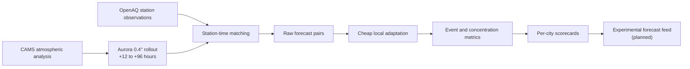

# IndiaAQBench

**An open benchmark for a hard question: can a cheap, global air-quality forecast
be made good enough to warn people about dangerous pollution episodes?**

Not "is the average error small" — average error is easy to improve and nearly
useless here. The question is whether a system catches the days when PM2.5 goes
past 121 µg/m³ (India's "Very Poor" threshold), because that is when emergency
measures actually trigger.

Built on [Microsoft Aurora](https://github.com/microsoft/aurora), Copernicus
CAMS, NOAA GFS, and 1.49 million OpenAQ station observations across nine Indian
cities. Everything below is reproducible from this repository.

---

## What the project found

| Finding | Evidence |
|---|---|
| **Optimising average error actively destroys episode detection.** They are not a trade-off — they are the same act. A regressor minimising MAE predicts near the conditional mean, which for a heavy-tailed variable sits *below* the alarm threshold. | A calibrator improved MAE 33.9 → 24.5 µg/m³ while probability of detection collapsed 0.474 → 0.125. Kept in the repo as a documented negative result. |
| **The pollution model was the wrong instrument; the boundary layer carries the signal.** | Adding boundary-layer height lifted discrimination (AUC) 0.927 → 0.973 and skill (CSI) 0.476 → 0.682. Boundary-layer meteorology *alone*, with no pollution model at all, beat the full pollution setup. |
| **A free forecast was sufficient — no GPU spend needed.** | NOAA GFS retained ~76–81% of the idealised gain and cleared the pre-declared bar, so a planned Aurora 1.5 GPU rollout was cancelled on evidence. |
| **The project's own founding premise was wrong, and is documented as wrong.** | It assumed Patna and Varanasi had no public forecast. They do. The "400 m" figure that motivated the target choice describes a Delhi-only model nest, not the national system. |
| **Most of the benchmark's evidence is one city, and the README says so.** | 89.1% of all Very Poor+ events are Delhi — the city explicitly *not* being targeted. Patna has 5 test events, Varanasi has 0. |

---

## How the work was kept honest

This is the part worth reading if you care about method rather than results.

- **Decision rules were committed to git before the results existed.** The
  boundary-layer experiment's pass/fail thresholds are in commit `2ab1c50`; the
  result came later. The commit order is checkable by anyone.
- **Cheap kill-tests before expensive builds.** Rather than run a GPU rollout to
  see if boundary-layer data helps, reanalysis was used as a *perfect-knowledge
  upper bound*. If perfect information hadn't helped, a forecast never would —
  and the spend would have been avoided for a few hundred MB of downloads.
- **The held-out test set has never been scored.** Every number above is
  train-split, out-of-fold. That is deliberate: it is the only honest evidence
  left, and it is spent once.
- **Negative results are kept, not deleted.** The failed calibrator, the
  falsified premise, and an unresolved data anomaly in Varanasi are all in the
  repository with their reasoning.
- **One integrity check still fails and has not been waived.** Aurora violates
  `PM1 ≤ PM2.5 ≤ PM10` on 463 of 80,730 rows. It stays visible in the audit.

---

## Where to start

| If you want | Read |
|---|---|
| The 60-second version | this page |
| Why episode detection failed, and the fix | [`docs/EPISODE_SKILL_DIAGNOSIS.md`](docs/EPISODE_SKILL_DIAGNOSIS.md) |
| The boundary-layer result | [`docs/BLH_CEILING_RESULT.md`](docs/BLH_CEILING_RESULT.md) |
| How the premise was falsified | [`docs/TARGET_REEVALUATION.md`](docs/TARGET_REEVALUATION.md) |
| Current state, warts included | [`docs/PROJECT_STATUS.md`](docs/PROJECT_STATUS.md) |
| Decisions session by session | [`JOURNAL.md`](JOURNAL.md) |

> **Research-use disclaimer:** this is an experimental research benchmark, not an
> official air-quality warning service. It is not validated for operational use.
> Do not use it as the sole basis for health or emergency decisions.

---

## Why this exists

The project originally assumed Patna, Varanasi, Kanpur, and Lucknow lacked a
public multi-day forecast. That premise was falsified: the 400 m AQEWS figure
describes the Delhi nest, while national/regional AQEWS, SILAM, and bulletin
products cover a much broader Indian domain. Direct portal coverage must still
be confirmed before making precise city-level incumbent claims.

The useful question that survives is narrower and more defensible. Global-tier
CAMS performed poorly on episode detection in this benchmark, while a trivial
local anchor substantially improved it. IndiaAQBench now tests when cheap local
and boundary-layer adaptation can turn that global tier into a useful warning
input. Delhi remains a data-rich development environment, not evidence of
transfer to other cities.

The research thesis is deliberately constrained:

- start with a global model that is inexpensive to run;
- correct its local surface bias using public station observations;
- test whether the correction transfers to stations and cities excluded from
  fitting;
- publish failures, uncertainty, and compute cost alongside successes;
- publish an operating point and every miss before considering a transparent
  experimental forecast feed.

The goal is not to claim that a low-cost system replaces high-resolution
regional chemistry models. The goal is to measure how far a reproducible,
low-compute approach can go—and where it fails.

## What “useful” means

Average error is not the primary success criterion. A forecast can have a good
mean absolute error (MAE) while smoothing away the pollution episodes that
matter most.

IndiaAQBench therefore treats **Very Poor or worse PM2.5 conditions
(≥121 μg/m³)** as the headline event and reports:

- **POD (probability of detection):** what fraction of observed events were
  forecast;
- **FAR (false-alarm ratio):** what fraction of event forecasts did not occur;
- **CSI (critical success index):** a combined score that penalizes both misses
  and false alarms;
- the number of observed events, so small samples cannot look authoritative.

Concentration metrics such as MAE, RMSE, bias, and correlation remain useful,
but they are secondary. This choice already exposed a failed early calibrator:
it improved MAE while eliminating severe-event detection in a pilot. That
pilot used superseded station registries and is not a final benchmark result,
but it established the safety requirement now enforced in the calibrator.

## The pipeline



CAMS supplies the current global atmospheric state; Aurora predicts how that
state evolves; OpenAQ provides surface observations for evaluation and local
correction. The benchmark compares raw Aurora with persistence, historical
climatology, and the CAMS initialization field held constant through the same
evaluation path.

## Verified repository state

As of the 12 August 2026 status snapshot:

| Item | Verified state |
|---|---|
| OpenAQ ground-truth archive | 1,489,534 hourly observations across 9 cities |
| Station registry | 159 stations |
| Frozen forecast initializations | 56 dates: 32 train, 24 test |
| Actual CAMS forecast archive | Complete: 56 dates, 71,232 station-lead rows |
| CAMS atmospheric inputs for Aurora | Complete: 56 dates, 12.397 GiB, deep validated |
| Forecast horizon | +12 to +96 hours in 12-hour steps |
| Spatial transfer design | 20% hashed station holdout plus 3 fully held-out cities |
| Aurora rollout artifacts | 56/56 dates, 80,136 rows, 159 stations; worker and transfer checks passed |
| Canonical rollout manifest | 56 records, 56 unique dates, zero errors |
| Integrity audit | 39 checks: 36 pass, 2 expected legacy warnings, 1 auxiliary size-bin failure |
| Test suite | 99/99 passing locally |
| Current-registry forecast pairs | **56 of 56 dates; 80,136 rows** |
| Forward-24-hour headline metrics | Generated (`src/eval/rolling24.py`); not yet frozen, versioned, or wired into `src/report/` |
| Hourly-threshold sensitivity metrics | Generated; reported separately and never pooled with the 24-hour headline |
| Event-skill diagnosis | Complete on train-only/out-of-fold data; pooled evidence is Delhi-dominated |
| Option B ceiling result | **Proceed**: pooled ΔAUC +0.046, ΔCSI +0.206; Patna +0.183/+0.296; train-only perfect prognosis |
| Forecast-BLH result | **Free GFS sufficient**: pooled ΔAUC +0.0336, ΔCSI +0.1620; Patna +0.108/+0.101; do not run Aurora 1.5 for BLH |
| Current experiment | Forecast-BLH gate complete; freeze/version retrospective scorecards next |

Two additional files under `results/pairs/` are legacy pilot-only artifacts
for dates outside the frozen schedule. The current 56 scheduled files replaced
the three overlapping pilot dates. The strict evaluator rejects the two
out-of-schedule files rather than silently mixing them into the benchmark.

The temporal cutoff was revised once, from **2025-07-01 to 2025-12-01**, under a
pre-registered contingency and before adaptation was trained on the revised
split. The reason was a verified lack of usable OpenAQ history before roughly
February 2025, which left the original training period without adequate severe
season coverage. This revision must be disclosed wherever results appear.

For the complete, dated breakdown, see [Project status](docs/PROJECT_STATUS.md).

## Evaluation design

The benchmark covers nine cities:

- **fit/validation pool:** Bangalore, Chennai, Delhi, Lucknow, Mumbai, Patna;
- **fully held-out cities:** Kanpur, Kolkata, Varanasi.

It has two spatial tests:

1. **L1 — held-out stations:** a fixed subset of stations inside fit-pool
   cities cannot contribute to learned calibration. This tests transfer to a
   new monitoring location in a city the method has seen.
2. **L2 — held-out cities:** all stations in Kanpur, Kolkata, and Varanasi are
   excluded from ordinary model fitting. This tests transfer to an entirely
   unseen city.

The benchmark also uses a chronological split at 2025-12-01: fitting uses only
earlier data and testing uses later data. Split constants live only in
[`src/splits.py`](src/splits.py).

Delhi is never transferable headline evidence. It supplies 89.1% of Very Poor+
windows; the current L2 event result is overwhelmingly Kolkata, and Varanasi
has zero benchmark events. Every credible result table must therefore show
per-city performance and exact event counts rather than relying on pooled L1/L2
labels.

## What has been built

- OpenAQ collection, quality control, resumable archive assembly, and a
  versioned station registry;
- CAMS acquisition and Aurora air-pollution inference;
- station-grid matching and forecast-pair generation;
- persistence, climatology, CAMS-start-held-constant, and raw Aurora baselines;
- concentration, category, and Very Poor+ event metrics;
- a separate forward-24-hour headline evaluator
  ([`src/eval/rolling24.py`](src/eval/rolling24.py)) whose windows are never
  pooled with the hourly-threshold sensitivity path;
- chronological and spatial holdouts;
- a 39-check integrity audit;
- calibrator no-harm guardrails and regime-shift tests;
- Component A, a chronological trailing local-observation anchor, with
  leakage and fallback tests;
- per-city/per-lead reporting and plotting code;
- a train-only diagnosis showing the dynamic-range, between-city, event-scarcity,
  and concentration-loss limits of the current approach;
- a pre-declared Option B kill-test using perfect-prognosis ERA5 boundary-layer
  fields, with a documented proceed verdict and explicit ceiling caveat;
- a pre-declared train-only GFS forecast-BLH gate, with exact cycle/lead
  provenance, per-city results, and a free-NWP-sufficient verdict;
- an interactive public-interface preview using explicitly illustrative data.
- the complete lead-dependent CAMS operational baseline for all 56 dates,
  retained with raw files, checksums, requests, and extraction provenance.

The repository deliberately keeps the rejected calibrator as a documented
negative baseline. Its failure is part of the research record, not a result to
hide.

## What has not been built or validated

- a fully clean audit across auxiliary PM1/PM10 outputs;
- a certified public correction (Component A has one lead-specific POD regression);
- a frozen, versioned 24-hour headline table connected to the reporting
  package (the table is generated, but `src/report/` still reads the hourly
  metrics file);
- the latest-cycle live runner and immutable forecast ledger;
- a deployed public experimental feed;
- year-round prospective evidence, including an untouched post-monsoon test;
- an Aurora fine-tune justified against the cheap-adaptation baseline.
- a verified city-level incumbent comparison and transferable non-Delhi event
  evidence.

Until those milestones exist, this repository should be presented as a
benchmark and system under active development—not as a validated public
forecast service.

## Roadmap to a public experimental feed

1. Freeze and version the retrospective scorecards and connect the 24-hour
   table to the reporting package.
2. Resolve the Varanasi observation anomaly and verify incumbent coverage
   before making city-specific product claims.
3. Review the prospective SILAM archive and design an initialization-aligned
   incumbent comparison.
4. Do not run Aurora 1.5 for BLH unless a future pre-declared experiment has a
   credible incremental-value case over GFS.
5. Build an immutable latest-cycle runner and run it privately in shadow mode.
6. Publish only after the target, operating point, data freshness, and rolling
   verification are supported by prospective evidence.

The intended product is transparent: visitors should be able to see what was
predicted, which model version produced it, which observations later occurred,
and where the system failed.

## Explore the repository

| Start here | Purpose |
|---|---|
| [Project status](docs/PROJECT_STATUS.md) | Plain-language scoreboard and immediate next steps |
| [Option B working brief](docs/CODEX_BRIEF_OPTION_B.md) | Pre-declared boundary-layer kill-test and decision rule |
| [Forecast-BLH result](docs/FORECAST_BLH_RESULT.md) | Why free GFS passed and Aurora 1.5 inference is not warranted |
| [Episode-skill diagnosis](docs/EPISODE_SKILL_DIAGNOSIS.md) | Why the first calibrator and pooled benchmark are insufficient |
| [Target re-evaluation](docs/TARGET_REEVALUATION.md) | Why the original “unserved cities” framing was retired |
| [Benchmark specification](docs/BENCHMARK_SPEC.md) | Task, metrics, baselines, cities, and split design |
| [Canonical agent brief](docs/AGENT_BRIEF.md) | Research decisions and non-negotiable constraints |
| [Execution plan](docs/EXECUTION_PLAN.md) | Dependencies, risks, and research gates |
| [Workstreams](docs/WORKSTREAMS.md) | Current parallel ownership model |
| [Public product specification](docs/PRODUCT_SPEC.md) | User experience, claim boundaries, and launch gates |
| [Live-feed specification](docs/LIVE_FEED_SPEC.md) | Versioned forecast contract and shadow-mode design |
| [Additional-data plan](docs/DATA_EXPANSION_PLAN.md) | Ranked expansion experiments and leakage rules |
| [Data-source audit](docs/DATA_SOURCE_AUDIT.md) | Verified access, licensing risks, and minimal pilots |
| [Publication readiness](docs/PUBLICATION_READINESS.md) | Repository security, licensing, and release blockers |
| [`web/`](web/) | Interactive product preview using illustrative data |
| [GPU runbook](scripts/setup_gpu.md) | Reproducing the 56-date rollout |
| [Development journal](JOURNAL.md) | Chronological decisions, bugs, and negative results |
| [`src/data/`](src/data/) | OpenAQ, CAMS, registry, and alignment code |
| [`src/pipeline/orchestrate.py`](src/pipeline/orchestrate.py) | Aurora rollout orchestration |
| [`src/eval/`](src/eval/) | Audit, baselines, benchmark, and metrics |
| [`src/model/calibrator.py`](src/model/calibrator.py) | Rejected baseline plus event-skill guardrails |
| [`src/model/anchor.py`](src/model/anchor.py) | Component A chronological local anchor |
| [`src/report/`](src/report/) | Scorecard and plot generation |

The full OpenAQ archive is intentionally not tracked at `HEAD` because of its
size. The repository contains the registry, pull provenance, code, and frozen
date manifest. No archive release is promised until redistribution terms,
attribution, and historical Git cleanup are resolved.

## Reproduce the code checks

Python 3.11 is the reference environment.

```bash
python -m venv .venv
# Windows: .venv\Scripts\activate
# macOS/Linux: source .venv/bin/activate
python -m pip install --upgrade pip
python -m pip install -r requirements.txt
python -m src.eval.audit
python -m pytest -q
```

Local data acquisition requires:

- an `OPENAQ_API_KEY` in `.env`;
- a Copernicus credential in `~/.cdsapirc`;
- acceptance of the relevant CAMS dataset licence;

The GPU rollout uses prevalidated offline bundles and receives none of those
credentials. It requires enough memory for Aurora inference: the project uses
a 48 GB GPU for the batch rollout, although a single step has been demonstrated
on a 32 GB CPU.

Do not trust a generated results table unless `python -m src.eval.audit` passes.
See the [GPU runbook](scripts/setup_gpu.md) for the controlled rollout.

## Data and model credits

- Ground observations: [OpenAQ](https://openaq.org/) and its underlying Indian
  providers.
- Atmospheric inputs: [Copernicus Atmosphere Monitoring Service
  (CAMS)](https://ads.atmosphere.copernicus.eu/).
- Foundation model: [Microsoft Aurora](https://github.com/microsoft/aurora).

For an honest portfolio description and milestone-based publishing guidance,
see [Portfolio guide](docs/PORTFOLIO_GUIDE.md).
